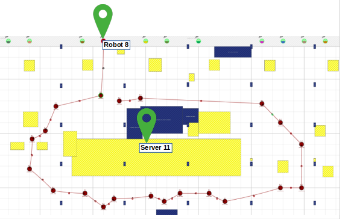

# Introduction

The experiment plan is initially made for running 6 scenarios in wilab2  testbed : 
* Scenario 1 : Single receiver with a USRP N200 device and a mobile running a peripheral BLE simulator
* Scenario 2 : Multi receiver with all available USRP N200 devices  and a mobile running a peripheral BLE simulator
* Scenario 3 : Multi emitter with a USRP N200 device  and all available mobiles emitting at  the same time; the first 4 scenes(scene 14-18) are run by only moving the target robot and the following scenes(scene 19-23) are run by moving both the target and interfering robot. 
* Scenario 4 : Multi emitter & receiver with all available USRP N200 devices and mobiles emitting at the same time
* Scenario 5 : 3 nRF52 dev kits used as BLE advertising devices, 4 USRPs used as receivers.
* Scenario 6 : Zigbee network (3 nodes), 4 USRP N200 devices used as receivers

It is important to know that all USRP devices are connected to servers and the mobiles are placed on top of robots which are moved in th testbed.

# Run experiments 

By varying the position of robots along the testebed and combining different servers and mobiles, each scenario contains several scenes.
The robot path is either the testbed  center or extremities, and this path is saved into a csv file.
All csv files to be used for running experiments are in the **conf** directory.
Until now, the following scenes have been generated :
- Scenario 1 : 6 scenes
- Scenario 2 : 5 scenes
- Scenario 3 : 2 scenes
- Scenario 4 : 0 scene
- Scenario 5 : 5 scenes
- Scenario 6 : 1 scene

## Correspondance between csv file path and scene map for already run experiments

### Scenario 1

Single receiver with a USRP N200 device and a mobile running a peripheral BLE simulator

| Scene                     | 1 | 2 | 3 | 4 | 5 | 6 | 7 | 8 | 9 | 10 |
|---------------------------|---|---|---|---|---|---|---|---|---|----|
| Server9                   | x | x |   |   |   |   |   |   |   |    |
| Server10                  |   |   | x | x |   |   |   |   |   |    |
| Server11                  |   |   |   |   | x | x |   |   |   |    |
| Server12                  |   |   |   |   |   |   | x | x |   |    |
| Server13                  |   |   |   |   |   |   |   |   |   |    |
| Server15                  |   |   |   |   |   |   |   |   | x | x  |
| robot2                    |   |   |   |   |   |   |   |   |   |    |
| robot3                    |   |   |   |   |   |   |   |   |   |    |
| robot5                    | x | x | x | x |   |   |   |   |   |    |
| robot6                    |   |   |   |   |   |   | x | x |   |    |
| robot8                    |   |   |   |   | x | x |   |   |   |    |
| robot11                   |   |   |   |   |   |   |   |   | x | x  |
| Duration (sec)            |   |   |   |   |   |   |   |   |   |    |
| Number of executions      | 2 | 2 | 0 | 0 | 1 | 1 | 1 | 1 | 0 | 0  |


The robots follow the path saved into the csv files:

* **doc/experiment_plan/robot5-server9-scenario1-scene1.png** corresponds to **conf/robot5-server9-scenario1-scene1.csv**


* **doc/experiment_plan/robot5-server9-scenario1-scene2.png** corresponds to **conf/robot5-server9-scenario1-scene2.csv**


* **doc/experiment_plan/robot8-server11-scenario1-scene5.png** corresponds to **conf/robot8-server11-scenario1-scene5.csv**


* **doc/experiment_plan/robot8-server11-scenario1-scene6.png** corresponds to **conf/robot8-server11-scenario1-scene6.csv**


* **doc/experiment_plan/robot6-server12-scenario1-scene7.png** corresponds to **conf/robot6-server12-scenario1-scene7.csv**


* **doc/experiment_plan/robot6-server12-scenario1-scene8.png** corresponds to **conf/robot6-server12-scenario1-scene8.csv**


### Scenario 2 :

Multi receiver with all available USRP N200 devices and a mobile running a peripheral BLE simulator

| Scene                     | 1 |  2  |  3  | 11 | 12 |
|---------------------------|---|-----|-----|----|----|
| Server9                   | x | (x) |  x  | x  | x  |
| Server10                  |   |     |     |    |    |
| Server11                  | x | (x) |     | x  | x  |
| Server12                  | x | (x) |     | x  | x  |
| Server13                  |   |     |     |    |    |
| Server15                  | x | (x) | (x) |    |    |
| robot1                    |   |     |  x  |    |    |
| robot2                    |   |     |     |    |    |
| robot3                    |   |     |     |    |    |
| robot5                    |   |     |     | x  | x  |
| robot6                    | x |  x  |     |    |    |
| robot8                    |   |     |     |    |    |
| robot11                   |   |     |     |    |    |
| Duration (sec)            |   |     |     |    |    |
| Number of executions      | 1 |  9  |  2  | 1  | 1  |

The robots follow exactly the same path as in scenario 1: 

* **doc/experiment_plan/robot5-allservers-scenario2-scene11.png** corresponds to **conf/robot5-allservers-scenario2-scene11.csv**


* **doc/experiment_plan/robot5-allservers-scenario2-scene12.png** corresponds to **conf/robot5-allservers-scenario2-scene12.csv**


### Scenario 3 :

Multi emitter with a USRP N200 device  and all available mobiles emitting at  the same time; the first 4 scenes(scene 14-18) are run by only moving the target robot and the following scenes(scene 19-23) are run by moving both the target and interfering robot.

| Scene                | 14 | 15 | 16 | 17 | 18 | 19 | 20 | 21 | 22 | 23 | 24 | 25 | 26 | 27 | 28 |
|----------------------|----|----|----|----|----|----|----|----|----|----|----|----|----|----|----|
| Server9              | x  | x  |    |    |    |    |    |    |    | x  | x  | x  |    |    |    |
| Server10             |    |    | x  |    |    |    | x  | x  |    |    |    |    | x  |    |    |
| Server11             |    |    |    | x  |    |    |    |    | x  | x  | x  |    |    | x  |    |
| Server12             |    |    |    |    | x  |    |    |    |    | x  | x  |    |    |    | x  |
| Server13             |    |    |    |    |    | x  |    |    |    |    |    |    |    |    |    |
| Server15             |    |    |    |    |    |    |    |    |    | x  | x  |    |    |    |    |
| robot2               |    |    |    |    |    |    |    |    |    |    |    |    |    |    |    |
| robot3               | x  | x  | x  | x  | x  | x  |    |    |    |    |    |    |    |    |    |
| robot5               | x  | x  | x  | x  | x  | x  | x  | x  | x  | x  | x  | x  | x  | x  | x  |
| robot6               |    |    |    |    |    |    |    |    |    |    | x  |    |    |    |    |
| robot7               |    |    |    |    |    |    |    |    |    | x  |    |    |    |    |    |
| robot8               | x  | x  | x  | x  | x  | x  | x  | x  | x  |    |    | x  | x  | x  | x  |
| robot11              | x  | x  | x  | x  | x  | x  |    |    |    |    |    |    |    |    |    |
| Duration (sec)       |    |    |    |    |    |    |    |    |    |    |    |    |    |    |    |
| Number of executions | 0  | 0  | 0  | 0  | 0  | 0  | 0  | 0  | 0  | 1  | 1  | 0  | 0  | 0  | 0  |

### Scenario 4 :

Multi emitter & receiver with all available USRP N200 devices and mobiles emitting at the same time

| Scene                | 29 | 30 |
|----------------------|----|----|
| Server9              | x  | x  |
| Server10             | x  | x  |
| Server11             | x  | x  |
| Server12             | x  | x  |
| Server13             | x  | x  |
| Server15             | x  | x  |
| robot2               |    | x  |
| robot3               |    |    |
| robot5               | x  | x  |
| robot6               |    |    |
| robot8               | x  | x  |
| robot11              |    |    |
| Duration (sec)       |    |    |
| Number of executions | 0  | 0  |

### Scenario 5 :

In scenario 5, we're using :
- 3 nRF52 as BLE advertising devices (apuN2, apuP22 and apuQ2)
- 4 USRPs to receive BLE packets (server9, server11, server12 and server15)
Receiver output files will be, for each server :
- 60/300 seconds duration IQ file
- Sigmf file
- PCAP export

| Scene                | 31 | 32  | 35 | 36 | 37 |
|----------------------|----|-----|----|----|----|
| Server9              | x  | x   | x  | x  | x  |
| Server10             |    |     |    |    |    |
| Server11             | x  | x   | x  | x  | x  |
| Server12             | x  | x   | x  | x  | x  |
| Server13             |    |     |    |    |    |
| Server15             | x  | x   | x  | x  | x  |
| nRF52 apuN2          | x  | x   | x  |    |    |
| nRF52 apuP22         | x  | x   |    | x  |    |
| nRF52 apuQ2          | x  | x   |    |    | x  |
| Duration (sec)       | 60 | 300 | 60 | 60 | 60 |
| Number of executions | 4  |  1  | 3  | 2  | 3  |


```sh
cd testbed-controller/

# copy user's conf example
cp conf/user-example.yml conf/me.yml
# tweak it (password, username)
$EDITOR conf/me.yml

cd tools

tmux
# From now, [n] defines commands to be entered in n-th tmux window

[1] ./run.sh -f ../conf/me.yml -f ../conf/all.yml -i server9
[2] ./run.sh -f ../conf/me.yml -f ../conf/all.yml -i server11
[3] ./run.sh -f ../conf/me.yml -f ../conf/all.yml -i server12
[4] ./run.sh -f ../conf/me.yml -f ../conf/all.yml -i apuN2
# Wait for "Ok: ready to execute ansible commands in run/xxx-yyy/ansible" message

[1] cd run/xxx-yyy/ansible
[1] ../../../setup-usrp.sh server9

[2] cd run/xxx-yyy/ansible
[2] ../../../setup-usrp.sh server11

[3] cd run/xxx-yyy/ansible
[3] ../../../setup-usrp.sh server12

[4] cd run/xxx-yyy/ansible
[4] ../../../setup-nrf52.sh apuN2
[4] ../../../setup-nrf52-fw.sh -b apuN2

# Run GnuRadio for BLE demodulation
[1] ../../../setup-gr.sh -s server9 -m mobile11 -p "ble" -d 60 -e "scenario-5" -e "scene-32-2" -o
[2] ../../../setup-gr.sh -s server11 -m mobile11 -p "ble" -d 60 -e "scenario-5" -e "scene-35" -o
[3] ../../../setup-gr.sh -s server12 -m mobile11 -p "ble" -d 60 -e "scenario-5" -e "scene-35" -o
```

### Scenario 6 :

Zigbee network (3 nodes), 4 USRP N200 devices used as receivers

In scenario 6, we're using :
- 3 nRF52 as Zigbee devices ()
- 1 to 4 USRP(s) to receive and demodulate Zigbee packets (server9, server11, server12 and server15)
Receiver output files will, be, for each server :
- 1 minute duration IQ file
- Sigmf file
- PCAP export

| Scene                     | 38    |
|---------------------------|-------|
| Server9                   | x     |
| Server10                  |       |
| Server11                  | x     |
| Server12                  | x     |
| Server13                  |       |
| Server15                  | x     |
| nRF52 zotacC2             |       |
| nRF52 zotacD2             | x (e) |
| nRF52 apuN2               | x (c) |
| nRF52 apuO2               |       |
| nRF52 apuP22              | x (r) |
| nRF52 apuQ2               |       |
| Duration (sec)            | 60    |
| Number of executions      | 31    |

```sh
cd testbed-controller/

# copy user's conf example
cp conf/user-example.yml conf/me.yml
# tweak it (password, username)
$EDITOR conf/me.yml

cd tools

tmux
# From now, [n] defines commands to be entered in n-th tmux window

[1] ./run.sh -f ../conf/me.yml -f ../conf/all.yml -i server9
[2] ./run.sh -f ../conf/me.yml -f ../conf/all.yml -i zotacC2
[3] ./run.sh -f ../conf/me.yml -f ../conf/all.yml -i zotacD2
[4] ./run.sh -f ../conf/me.yml -f ../conf/all.yml -i apuN2
# Wait for "Ok: ready to execute ansible commands in run/xxx-server9/ansible" message

[1] cd run/xxx-yyy/ansible
[1] ../../../setup-usrp.sh server9

[2] cd run/xxx-yyy/ansible
[2] ../../../setup-nrf52.sh zotacC2
[2] ../../../setup-nrf52-fw.sh -c zotacC2

[3] cd run/xxx-yyy/ansible
[3] ../../../setup-nrf52.sh zotacD2
[3] ../../../setup-nrf52-fw.sh -r zotacD2

[4] cd run/xxx-yyy/ansible
[4] ../../../setup-nrf52.sh apuN2
[4] ../../../setup-nrf52-fw.sh -e apuN2

# Run GnuRadio for Zigbee demodulation
[1] ../../../setup-gr.sh -s server9 -m mobile11 -p "zigbee" -d 60 -e "scenario-6" -e "scene-38" -o
```
